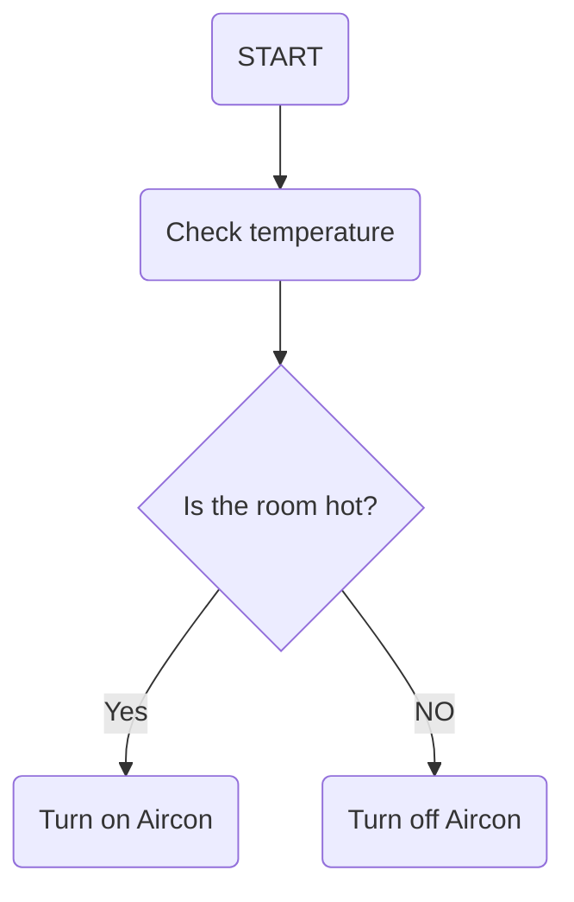
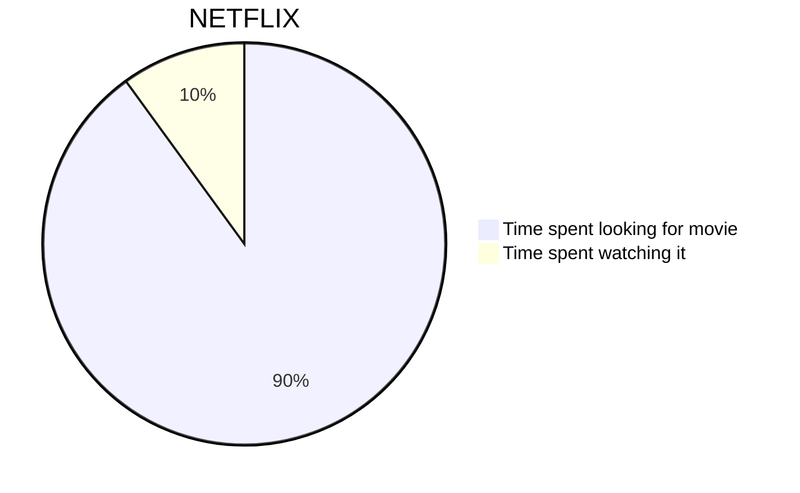
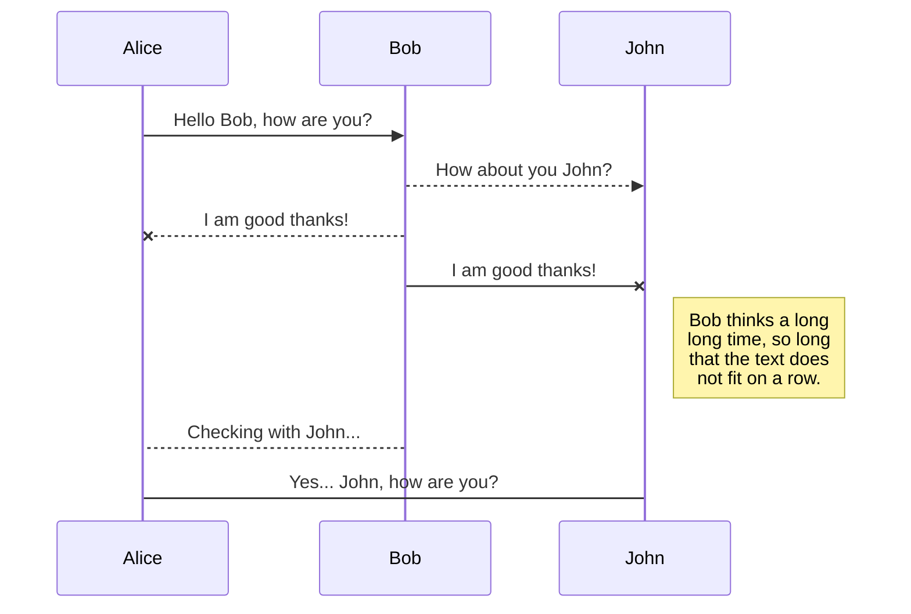

# how-to-doc
Learn how to doc my projects
test

# To install
1. VSCODE -> Markdown Preview Enhaced
2. npm -> mermaid
3. npm -> mathjax
4. npm -> Vega: A visualization Grammar
5. npm -> wavedrom

# Test external libraries 
## mermaid





# mathjax
## Wavelength equation
$$\lambda = \frac {v}{f}$$

# Vega
## CSV Integration

```Vega-lite
{
  "description": "Un gráfico de barras que muestra la cantidad de ventas por mes.",
  "data": {
    "values": [
      {"mes": "Enero", "ventas": 120},
      {"mes": "Febrero", "ventas": 90},
      {"mes": "Marzo", "ventas": 180},
      {"mes": "Abril", "ventas": 75},
      {"mes": "Mayo", "ventas": 200}
    ]
  },
  "mark": "bar",
  "encoding": {
    "x": {"field": "mes", "type": "ordinal"},
    "y": {"field": "ventas", "type": "quantitative"}
  }
}
```
## Temperature sensor

### I2C Protocol
### Secuence es propia de md
```sequence
MCU->Sensor: Start
MCU->Sensor: Slave address
Sensor-->MCU: ACK
MCU->Sensor: Data
Sensor-->MCU: ACK
MCU->Sensor: Stop
```
### I2C Timing diagram

```wavedrom
{signal: [
    {
        name: 'SCL',
        wave: '1.01010101010101'
    },
    {
        name: 'SDA',
        wave: '103.4.5.6.7.8.01',
        data: ['D6', 'D5', 'D4', 'D0', 'R/W', 'ACK']
    }
]
}
